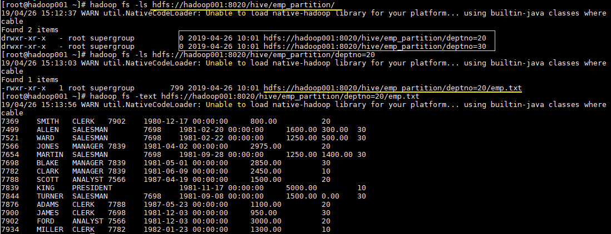

# Hive分区表和分桶表

## 一、分区表

### 1.1 概念

Hive 中的表对应为 HDFS 上的指定目录，在查询数据时候，默认会对全表进行扫描，这样时间和性能的消耗都非常大。

**分区为 HDFS 上表目录的子目录**，数据按照分区存储在子目录中。如果查询的 `where` 字句的中包含分区条件，则直接从该分区去查找，而不是扫描整个表目录，合理的分区设计可以极大提高查询速度和性能。

### 1.2 使用场景

通常，在管理大规模数据集的时候都需要进行分区，比如将日志文件按天进行分区，从而保证数据细粒度的划分，使得查询性能得到提升。

### 1.3 创建分区表

在 Hive 中可以使用 `PARTITIONED BY` 子句创建分区表。表可以包含一个或多个分区列，程序会为分区列中的每个不同值组合创建单独的数据目录。下面的我们创建一张雇员表作为例子：

```sql
 CREATE EXTERNAL TABLE emp_partition(
    empno INT,
    ename STRING,
    job STRING,
    mgr INT,
    hiredate TIMESTAMP,
    sal DECIMAL(7,2),
    comm DECIMAL(7,2)
    )
    PARTITIONED BY (deptno INT)   -- 按照部门编号进行分区
    ROW FORMAT DELIMITED FIELDS TERMINATED BY "\t"
    LOCATION '/hive/emp_partition';
```

### 1.4 加载数据到分区表

加载数据到分区表时候**必须要指定数据所处的分区**：

```sql
--加载部门编号为20的数据到表中
LOAD DATA LOCAL INPATH "/usr/file/emp20.txt" OVERWRITE INTO TABLE emp_partition PARTITION (deptno=20)
--加载部门编号为30的数据到表中
LOAD DATA LOCAL INPATH "/usr/file/emp30.txt" OVERWRITE INTO TABLE emp_partition PARTITION (deptno=30)
```

### 1.5 查看分区目录

这时候我们直接查看表目录，可以看到表目录下存在两个子目录，分别是 `deptno=20` 和 `deptno=30`,这就是分区目录，分区目录下才是我们加载的数据文件。

```bash
hadoop fs -ls  hdfs://hadoop001:8020/hive/emp_partition/
```

这时候当你的查询语句的 `where` 包含 `deptno=20`，则就去对应的分区目录下进行查找，而不用扫描全表。

<figure><figcaption></figcaption></figure>

## 二、分桶表

### 1.1 简介

