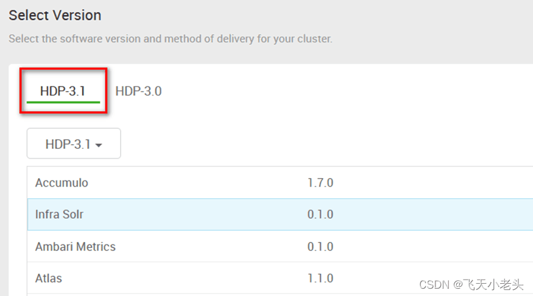
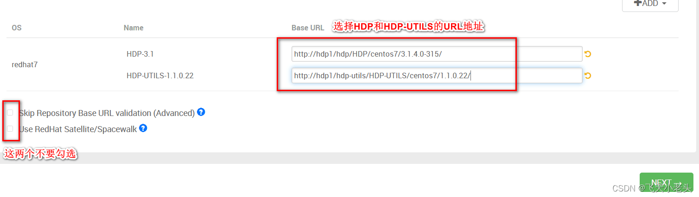
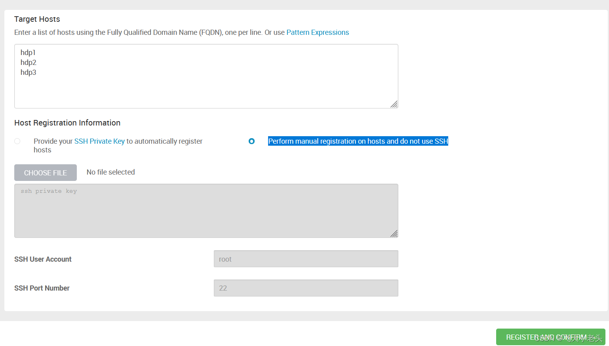

# +Docker从头完全部署

## 1.环境及软件准备

| Virtual Machine Software | Docker          |
| ------------------------ | --------------- |
| OS                       | Ubuntu 20.04LTS |
| VM OS                    | CentOS 7.9      |
| Ambari                   | 2.7.4.0         |
| HDP                      | 3.1.4.0         |
| HDP-UTILS                | 1.1.0.22        |
| Java                     | JDK8            |
| SQL                      | Mysql 5.7       |


你可以在这里查询软件之间的版本支持度


Ambari、HDP、HDP-UTILS安装包下载链接如下


**提取码：3rwq**


### 1.1 创建并初配置一台原型机

后续主节点或从节点还需从这个容器打包后的镜像再延展。

```sh
docker pull centos:centos7.9.2009 #拉取centos79镜像
docker run -it --name=bg-c79-init centos:centos7.9.2009 #从镜像创建容器
```

因为docker的OS镜像都非常精简，所以我们必需提前安装好一些软件包

```sh
yum update -y #更新源
yum install epel-release -y && yum update -y #添加EPEL软件仓库(Extra Packages for Enterprise Linux)
yum install -y htop sudo proxychains4 net-tools git wget curl initscripts openssh openssh-server cronie
```


不用在这一步安装所有后面主从节点共同需要包，因为在配置好免密那一步之后，可以使用pssh来同时让所有节点执行相同的命令。


## 2.准备工作

### 2.1关闭防火墙

默认没有，那就不用管。

### 2.2安装JDK

<pre class="language-sh"><code class="lang-sh"><strong>sudo yum install java-1.8.0-openjdk.x86_64 java-1.8.0-openjdk-devel.x86_64 java-1.8.0-openjdk-headless.x86_64
</strong>
readlink -f /usr/bin/java #查看java安装位置

sudo vim /etc/profile
export JAVA_HOME=/usr/lib/jvm/java-1.8.0-openjdk-1.8.0.372.b07-1.el7_9.x86_64
export PATH=$PATH:$JAVA_HOME/bin

</code></pre>

### 2.3关闭SELinux

默认没有，那就不用管。

### 2.4安装额外软件包

* sshpass：用明文方式自动输入ssh密码，快速免密脚本需要。
* pssh：同时对多个机器使用shh执行命令，方便管理后续集群。

### 2.5配置集群内网并创建集群服务器

将原型机打包

```sh
#查看容器ID
docker ps -a
#把容器打包成镜像，同时可以选择上传到docker hub云端保存
docker commit name[:tag] containerID
```

创建docker网络

```sh
docker network create bigdata --subnet=172.19.0.0/16 --gateway=172.19.0.1
docker network list #查看所有网络
docker network inspect bigdata #查看bigdata网络详细信息
```


这个命令的作用是在Docker中创建一个名为"bigdata"的网络，该网络的子网为172.19.0.0/16，网关为172.19.0.1。

具体解释如下：

* `docker network create`：创建Docker网络。
* `bigdata`：指定网络的名称为"bigdata"。
* `--subnet=172.19.0.0/16`：设置网络的子网为172.19.0.0/16。这意味着该网络可以分配65534个IP地址（172.19.0.0到172.19.255.255），其中172.19.0.1被指定为网关地址，不能使用作为容器IP地址。
* `--gateway=172.19.0.1`：设置网络的网关地址为172.19.0.1。所有连接到该网络的容器都将使用该地址作为默认网关。


开启内核swap资源限制支持

```sh
sudo vim /etc/default/grub
#添加以下值
GRUB_CMDLINE_LINUX="cgroup_enable=memory swapaccount=1"

#保存文件后
sudo update-grub
sudo reboot
```

创建主节点，拥有以下属性

* 属于bigdata局域网，ip为172.19.0.2
* 对host主机开放8080端口
* 分配shell命令行
* 分配6cpu核
* 分配16G内存
* 配置了systemd服务

```sh
docker run --network bigdata --ip 172.19.0.2 -p 8080:8080 \
 --name bg-c79-0 -it --cpus=6 -m 16G --privileged=true \
  -v /sys/fs/cgroup:/sys/fs/cgroup:ro --tmpfs /run --tmpfs /run/lock \
   --stop-signal=RTMIN+3 \
   xiamussr/bigdata-base:1.1 /usr/sbin/init
```

等容器显示的一系列操作不再继续时，关闭此终端。容器仍会以启动的状态在后台

创建从节点,，拥有以下属性

* 属于bigdata局域网
* 分配shell命令行
* 分配4cpu核
* 分配12G内存

```sh
docker run --network bigdata --ip 172.19.0.3 --name bg-c79-1 -it --cpus=4 -m 12G --privileged=true -v /sys/fs/cgroup:/sys/fs/cgroup:ro --tmpfs /run --tmpfs /run/lock --stop-signal=RTMIN+3 xiamussr/bigdata-base:1.1 /usr/sbin/init
docker run --network bigdata --ip 172.19.0.4 --name bg-c79-2 -it --cpus=4 -m 12G --privileged=true -v /sys/fs/cgroup:/sys/fs/cgroup:ro --tmpfs /run --tmpfs /run/lock --stop-signal=RTMIN+3 xiamussr/bigdata-base:1.1 /usr/sbin/init
docker run --network bigdata --ip 172.19.0.5 --name bg-c79-3 -it --cpus=4 -m 12G --privileged=true -v /sys/fs/cgroup:/sys/fs/cgroup:ro --tmpfs /run --tmpfs /run/lock --stop-signal=RTMIN+3 xiamussr/bigdata-base:1.1 /usr/sbin/init
docker run --network bigdata --ip 172.19.0.6 --name bg-c79-4 -it --cpus=4 -m 12G --privileged=true -v /sys/fs/cgroup:/sys/fs/cgroup:ro --tmpfs /run --tmpfs /run/lock --stop-signal=RTMIN+3 xiamussr/bigdata-base:1.1 /usr/sbin/init
```


`docker stats containerID`监视容器资源使用



`docker exec -it containerID /bin/bash` 开启容器命令行


### 2.6安装MySQL（主节点）

<pre class="language-sh"><code class="lang-sh"><strong>sudo yum install -y https://dev.mysql.com/get/mysql57-community-release-el7-11.noarch.rpm #添加mysql到yum的安装列表中
</strong>sudo rpm --import https://repo.mysql.com/RPM-GPG-KEY-mysql-2022 #添加对mysql安装的密钥
sudo yum install -y mysql-community-server #安装mysql-server
sudo systemctl start mysqld
sudo systemctl enable mysqld
</code></pre>

重置初始密码和免输密码登录


[mysql](../../../../../software/mysql/)


修改`/etc/my.cnf`添加以下配置

```
[mysqld]
port=3306
bind-address=0.0.0.0
```

```sh
systemctl restart mysqld #开启服务
netstat -nltp | grep 3306 # 查看mysql默认的3306端口号是否存在
systemctl enable mysqld # 将mysql服务加入到开机自启
```

### 2.7配置域名映射（主节点）

同时开启三台虚拟机，输入`ifconfig`查看各个的ip地址

`vim /etc/hosts`写入映射规则，根据ip追加以下内容

```sh
172.19.0.2 hdp0
172.19.0.3 hdp1
172.19.0.4 hdp2
172.19.0.5 hdp3
172.19.0.6 hdp4
```

使用脚本\[0]将hosts文件传到所有其它主机


[jiao-ben.md](../../../../linux/jiao-ben.md)


### 2.8配置免密

用脚本\[1]快速配置所有主机互相免密


[jiao-ben.md](../../../../linux/jiao-ben.md)


### 2.9时间同步

#### 2.9.1主服务器时间配置(主节点)

选一台服务器作时间服务器，这里以hdp1作为时间服务器，其他服务器以时间服务器时间为准

```sh
sudo yum install ntp -y
sudo vim /etc/ntp.conf
```

授权192.168.137.0-192.168.137.255网段上的所有机器可以从这台机器上查询和同步时间

```sh
#修改
#restrict 192.168.1.0 mask 255.255.255.0 nomodify notrap
#为
restrict 192.168.137.0 mask 255.255.255.0 nomodify notrap #我这里使用的网段为137，具体网段根据服务器的ip而定

#注释
#server 0.centos.pool.ntp.org iburst
#server 1.centos.pool.ntp.org iburst
#server 2.centos.pool.ntp.org iburst
#server 3.centos.pool.ntp.org iburst
# 添加如下，使用阿里云服务器时间
server ntp1.aliyun.com iburst
server ntp2.aliyun.com iburst
server ntp3.aliyun.com iburst
server ntp4.aliyun.com iburst
server ntp5.aliyun.com iburst
server ntp6.aliyun.com iburst
server ntp7.aliyun.com iburst

#追加，当该节点丢失网络连接，依然可以采用本地时间作为时间服务器为集群中的其他节点提供时间同步
server 127.127.1.0
fudge 127.127.1.0 stratum 10
```

```sh
sudo systemctl start ntpd # 启动ntpd服务
sudo systemctl enable ntpd # 配置ntpd服务开机自启
```

#### 2.9.2其它服务器时间配置(主节点)

创建一个host.txt文件，写入所有从节点

```
hdp1
hdp2
hdp3
hdp4
```

```sh
pssh -h host.txt -i yum install -y ntpdate #安装时间同步包
pssh -h host.txt ntpdate hdp0 #同步时间
```

创建tmp.txt文件，写入以下内容，表示每小时的第29分和59分同步一次时间

```
29,59 * * * * /usr/sbin/ntpdate hdp0
```

然后使用pssh将这个内容写入所有从节点的crontab

```sh
pssh -h host.txt -t 10 -I < tmp.txt 'crontab -'
```

## 3.安装Ambari

### 3.1配置ambari和hdp的yum源（主节点）

```sh
# 安装httpd
sudo yum install -y httpd
# 启动http
sudo systemctl start httpd
# 将httpd加入到开机自启
sudo systemctl enable httpd
```

使用`docker cp`将压缩包放入主节点容器内

```sh
# 先在/var/www/html目录下创建ambari、hdp、hdp-utils文件夹
mkdir /var/www/html/ambari
mkdir /var/www/html/hdp
mkdir /var/www/html/hdp-utils
# 这里的-C是指定解压目录
tar -zxf /opt/ambari-2.7.4.0-centos7.tar.gz -C /var/www/html/ambari 
tar -zxf /opt/HDP-3.1.4.0-centos7-rpm.tar.gz -C /var/www/html/hdp
tar -zxf /opt/HDP-UTILS-1.1.0.22-centos7.tar.gz -C /var/www/html/hdp-utils/
```

配置yum源，**ip记得改**

```sh
# 配置ambari源
vim /etc/yum.repos.d/ambari.repo

#内容如下
[ambari]
name=ambari
baseurl=http://192.168.80.xxx/ambari/ambari/centos7/2.7.4.0-118
gpgcheck=0
```

<pre class="language-sh"><code class="lang-sh"># 配置hdp和hdp-utils源
vim /etc/yum.repos.d/hdp.repo

# 内容如下
<strong>[HDP]
</strong>name=HDP
baseurl=http://192.168.80.xxx/hdp/HDP/centos7/3.1.4.0-315
gpgcheck=0
[HDP-UTILS]
name=HDP_UTILS
baseurl=http://192.168.80.xxx/hdp-utils/HDP-UTILS/centos7/1.1.0.22/
gpgcheck=0
</code></pre>

```sh
# yum创建缓存
yum clean all
yum makecache

# 通过yum repolist命令验证即可
yum repolist
```

配置好yum源后使用scp命令将ambari.repo和hdp.repo文件发送到其他节点的/etc/yum.repos.d/目录下

### 3.2配置和安装ambari-server（主节点）

```sh
yum install -y ambari-server #安装ambari-server
```

配置数据库

```sh
# 登录已经安装好的mysql
mysql -u root

mysql>  CREATE USER 'ambari'@'%' IDENTIFIED BY 'bigdata'; -- 创建ambari用户
Query OK, 0 rows affected (0.00 sec)

mysql> create database ambari;
Query OK, 1 row affected (0.00 sec) -- 创建ambari数据库

mysql> grant all on ambari.* to ambari@'%';
Query OK, 0 rows affected, 1 warning (0.00 sec) -- 授权

mysql> use ambari; -- 使用已经创建好的ambari数据库
Database changed

mysql> source /var/lib/ambari-server/resources/Ambari-DDL-MySQL-CREATE.sql; -- 使用ambari-server提供的sql脚本创建相关表

```

下载jdbc驱动


下载驱动



这里我使用最新版jdbc8.0.33之后可以运行ambari-server，但是和mysql5.7适配的jdbc5.1.44会一直遇到已耗尽最大连接次数和flush的问题，看了很多解决办法没解决掉。不过用8.0.33也没什么不好的。


将jdbc驱动包放到指定目录

```sh
#查看安装位置和内容
rpm -qpl mysql-connector-j-8.0.33-1.el7.noarch.rpm
#安装
sudo rpm -ivh mysql-connector-j-8.0.33-1.el7.noarch.rpm
#查看是否安装
rpm -qa | grep mysql-connector-j
# 创建目录
mkdir -p /usr/share/java
# 如果mysql-connector-java.jar不在/usr/share/java/下则复制一份过去
```

配置ambari-server

```sh
[root@hdp1 Downloads]# ambari-server setup
Using python  /usr/bin/python
Setup ambari-server
Checking SELinux...
SELinux status is 'disabled'
Customize user account for ambari-server daemon [y/n] (n)? y
Enter user account for ambari-server daemon (mumu): root   
Adjusting ambari-server permissions and ownership...
Checking firewall status...
Checking JDK...
[1] Oracle JDK 1.8 + Java Cryptography Extension (JCE) Policy Files 8
[2] Custom JDK
==============================================================================
Enter choice (1): 2
WARNING: JDK must be installed on all hosts and JAVA_HOME must be valid on all hosts.
WARNING: JCE Policy files are required for configuring Kerberos security. If you plan to use Kerberos,please make sure JCE Unlimited Strength Jurisdiction Policy Files are valid on all hosts.
Path to JAVA_HOME: /usr/lib/jvm/java-1.8.0-openjdk-1.8.0.372.b07-1.el7_9.x86_64/jre
Validating JDK on Ambari Server...done.
Check JDK version for Ambari Server...
JDK version found: 8
Minimum JDK version is 8 for Ambari. Skipping to setup different JDK for Ambari Server.
Checking GPL software agreement...
GPL License for LZO: https://www.gnu.org/licenses/old-licenses/gpl-2.0.en.html
Enable Ambari Server to download and install GPL Licensed LZO packages [y/n] (n)? 
Completing setup...
Configuring database...
Enter advanced database configuration [y/n] (n)? y
Configuring database...
==============================================================================
Choose one of the following options:
[1] - PostgreSQL (Embedded)
[2] - Oracle
[3] - MySQL / MariaDB
[4] - PostgreSQL
[5] - Microsoft SQL Server (Tech Preview)
[6] - SQL Anywhere
[7] - BDB
==============================================================================
Enter choice (1): 3
Hostname (localhost): hdp1
Port (3306): 
Database name (ambari): 
Username (ambari): 
Enter Database Password (bigdata): 
Invalid characters in password. Use only alphanumeric or _ or - characters
Enter Database Password (bigdata): 
Invalid characters in password. Use only alphanumeric or _ or - characters
Enter Database Password (bigdata): 
Configuring ambari database...
Should ambari use existing default jdbc /usr/share/java/mysql-connector-java.jar [y/n] (y)? 
Configuring remote database connection properties...
WARNING: Before starting Ambari Server, you must run the following DDL directly from the database shell to create the schema: /var/lib/ambari-server/resources/Ambari-DDL-MySQL-CREATE.sql
Proceed with configuring remote database connection properties [y/n] (y)? 
Extracting system views...
ambari-admin-2.7.4.0.118.jar
....
Ambari repo file doesn't contain latest json url, skipping repoinfos modification
Adjusting ambari-server permissions and ownership...
Ambari Server 'setup' completed successfully.
[root@hdp1 Downloads]# 
```

启动ambari

```sh
ambari-server start
```

### 3.3 安装、配置ambari-agent节点（所有节点Optional）

你也可以在下一步的**2-Install Options**中选择Provide your SSH and autoconf就可以跳过这一步

<pre class="language-sh"><code class="lang-sh"><strong>yum install -y ambari-agent #安装ambari-agent
</strong>sudo vim /etc/ambari-agent/conf/ambari-agent.ini
# 将hostname=localhost修改为hdp1
# [server]
# hostname=hdp1
ambari-agent start #启动服务
</code></pre>

## 4. 部署HDP

通过ip:8080就可以访问Web UI了，登录ambari，默认用户名和密码都是admin。

点击`ClusterInformation` --> `LAUNCH INSTALL WIZARD`开始安装向导



填集群名字



HDP选3.1

<figure><figcaption></figcaption></figure>

OS选Redhat7填入并移除所有其它条目输入节点主机名列表输入节点主机名列

HDP和HDP-UTILS就填/var/www/html/下的对应路径，然后把/var/www/html改成http://hdp1/，比如[http://hdp1/hdp/HDP/centos7/3.1.4.0-315/](http://hdp1/hdp/HDP/centos7/3.1.4.0-315/)和[http://hdp1/hdp-utils/HDP-UTILS/centos7/1.1.0.22/](http://hdp1/hdp-utils/HDP-UTILS/centos7/1.1.0.22/)

最后两个选项不要勾选。

<figure><figcaption></figcaption></figure>



输入节点主机名列表，并选择Perform manual registration on hosts and do not use SSH，因为我们刚才已经配置过了ambari-agent。

<figure><figcaption></figcaption></figure>



等待服务器注册，并检查潜在的error，然后点击NEXT


遇到过一个，[已记录在DeBug中](../../../../../bigdata/bang-zhu/debug.md#error-occured-during-stack-advisor-command-invocation-cannot-create-var-run-ambari-server-stack-reco)。




选择需要安装的组件

如果你刚学习大数据，我建议你从以下几个比较基础和常用的组件开始：

HDFS：Hadoop分布式文件系统，是Hadoop的核心组件之一，提供了高可靠性和高吞吐量的数据存储服务

YARN：Hadoop资源管理器，是Hadoop的核心组件之一，负责管理集群中的计算资源，并调度各种应用程序的运行。

MapReduce：Hadoop分布式计算框架，是Hadoop最早提供的编程模型，可以实现批量数据处理

Hive：基于Hadoop的数据仓库系统，支持使用类SQL语言进行数据查询和分析。&#x20;

HBase：基于Hadoop的非关系型分布式数据库，适合存储和访问海量结构化或半结构化数据。

Spark：基于内存计算的大数据处理框架，支持批处理、流处理、机器学习等多种场景。

像我最开始就只选择了YARN+MapReduce2，毕竟后续可以继续安装



选择每个组件具体安装在哪个服务器上。

ZooKeeper Server每个服务器都要安装

Metrics Collector可以选择装两个



分配主节点和从节点，仅供参考

<figure><figcaption></figcaption></figure>



设置服务对应的密码

<figure><figcaption></figcaption></figure>

配置大数据组件参数，这个根据需求配置即可，如果不了解大数据组件的相关配置可以先使用默认，后续可通过查证资料进行更改配置

Java heap不要太大，20%左右吧。

YARN的内存，50%吧。



展示前面步骤的结果



部署，启动，测试



## 5. Enjoy

\:-)

