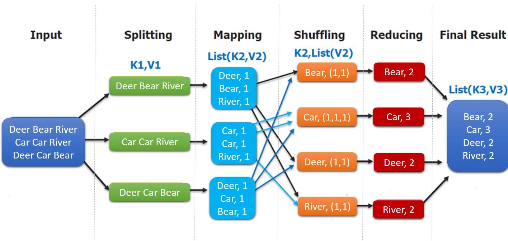
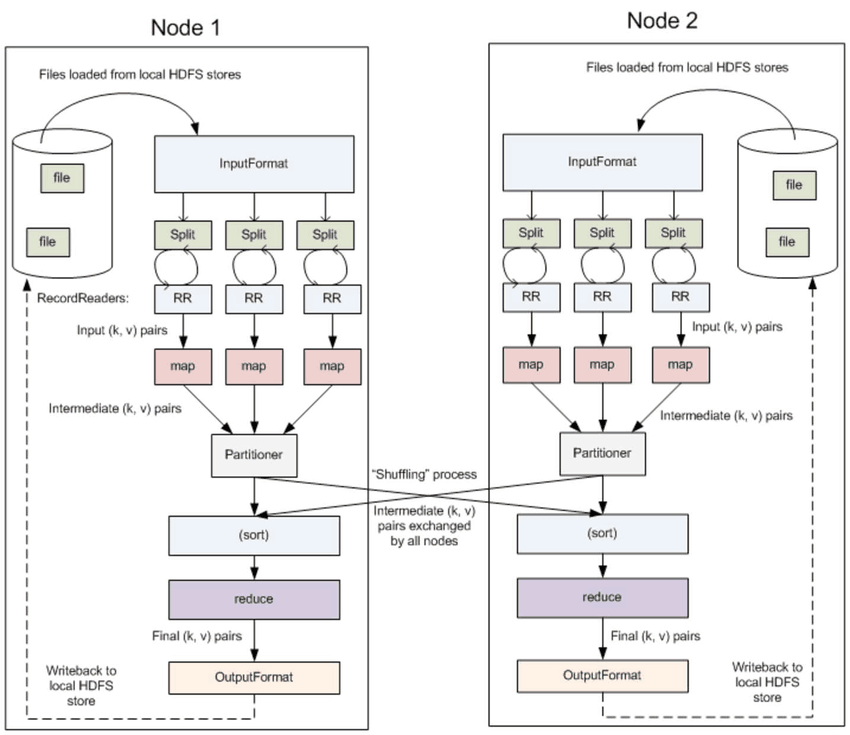
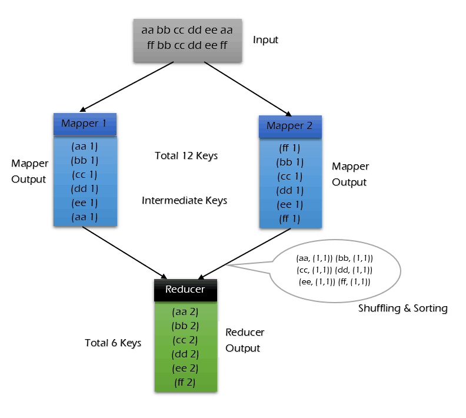
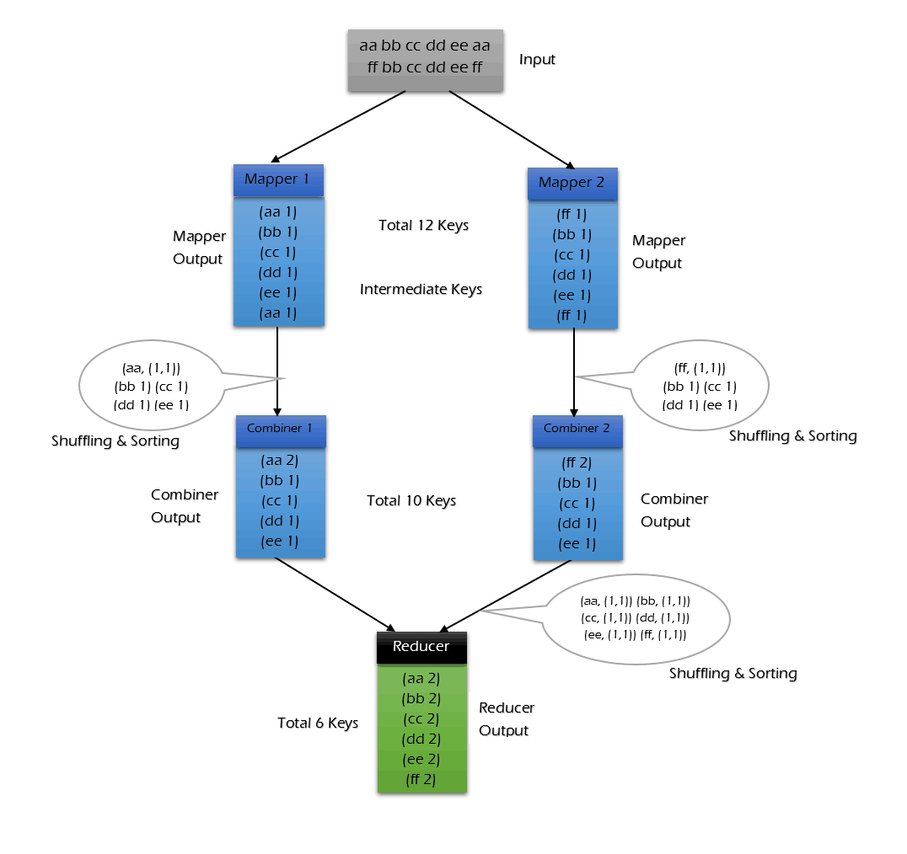

# MapReduce


MapReduce paper PDF


## 一、MapReduce概述

Hadoop MapReduce 是一个分布式计算框架，用于编写批处理应用程序。编写好的程序可以提交到 Hadoop 集群上用于并行处理大规模的数据集。

MapReduce 作业通过将输入的数据集拆分为独立的块，这些块由 `map` 以并行的方式处理，框架对 `map` 的输出进行排序，然后输入到 `reduce` 中。MapReduce 框架专门用于 `<key，value>` 键值对处理，它将作业的输入视为一组 `<key，value>` 对，并生成一组 `<key，value>` 对作为输出。输入和输出的 `key` 和 `value` 都必须实现[Writable](http://hadoop.apache.org/docs/stable/api/org/apache/hadoop/io/Writable.html) 接口。


```
(input) <k1, v1> -> map -> <k2, v2> -> combine -> <k2, v2> -> reduce -> <k3, v3> (output)
```


## 二、MapReduce编程模型简述

这里以词频统计为例进行说明，MapReduce 处理的流程如下：

<figure><figcaption></figcaption></figure>

Input到Split可以由HDFS自主完成，分块存储。

map任务所在节点从本地磁盘或者从远程获取数据，进行处理，输出键值对。

shuffle操作就比较抽象和复杂了，shuffle操作由三个小部分组成，

第一，map任务最后需要预处理自己的输出，比如对键值对排序，合并，combiner等，这样可以减少通信的流量。

第二，map会对输出进行分区，分区是指将Map任务的输出结果按照一定的规则划分为若干个部分，每个部分对应一个Reduce任务，然后reduce任务所在节点访问所有map任务节点，远程获取属于自己的区。

第三，Reduce任务的数据接收、排序和合并等操作。

Reduce任务还需要执行自定义的reduce函数，对具有相同键的键值对进行聚合处理，比如求和、计数、平均等，并且输出最终的结果到HDFS或其他地方


Shuffle操作是MapReduce框架中非常重要和耗时的一步，需要进行有效的优化和管理，以使得整个MapReduce任务能够高效、可靠地执行。


## 三、combiner & partitioner

<figure><figcaption></figcaption></figure>

### 3.1 InputFormat & RecordReaders

`InputFormat` 将输出文件拆分为多个 `InputSplit`，并由 `RecordReaders` 将 `InputSplit` 转换为标准的\<key，value>键值对，作为 map 的输出。这一步的意义在于只有先进行逻辑拆分并转为标准的键值对格式后，才能为多个 `map` 提供输入，以便进行并行处理。

### 3.2 Combiner

`combiner` 是 `map` 运算后的可选操作，它实际上是一个本地化的 `reduce` 操作，它主要是在 `map` 计算出中间文件后做一个简单的合并重复 `key` 值的操作。这里以词频统计为例：

`map` 在遇到一个 hadoop 的单词时就会记录为 1，但是这篇文章里 hadoop 可能会出现 n 多次，那么 `map` 输出文件冗余就会很多，因此在 `reduce` 计算前对相同的 key 做一个合并操作，那么需要传输的数据量就会减少，传输效率就可以得到提升。

但并非所有场景都适合使用 `combiner`，使用它的原则是 `combiner` 的输出不会影响到 `reduce` 计算的最终输入，例如：求总数，最大值，最小值时都可以使用 `combiner`，但是做平均值计算则不能使用 `combiner`。

不使用 combiner 的过程：

<figure><figcaption></figcaption></figure>

使用combiner的过程：

<figure><figcaption></figcaption></figure>

可以看到使用 combiner 的时候，需要传输到 reducer 中的数据由 12keys，降低到 10keys。降低的幅度取决于你 keys 的重复率，下文词频统计案例会演示用 combiner 降低数百倍的传输量。

### 3.3 Partitioner

`partitioner` 可以理解成分类器，将 `map` 的输出按照 key 值的不同分别分给对应的 `reducer`，支持自定义实现，下文案例会给出演示。

## 四、MapReduce词频统计案例

### 4.1 项目简介

这里给出一个经典的词频统计的案例：统计如下样本数据中每个单词出现的次数。

```
Spark	HBase
Hive	Flink	Storm	Hadoop	HBase	Spark
Flink
HBase	Storm
HBase	Hadoop	Hive	Flink
HBase	Flink	Hive	Storm
Hive	Flink	Hadoop
HBase	Hive
Hadoop	Spark	HBase	Storm
HBase	Hadoop	Hive	Flink
HBase	Flink	Hive	Storm
Hive	Flink	Hadoop
HBase	Hive
```
