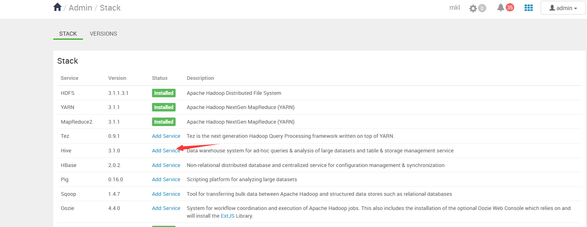
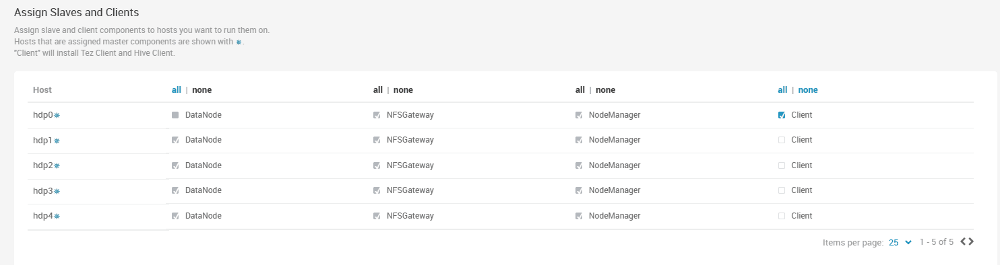
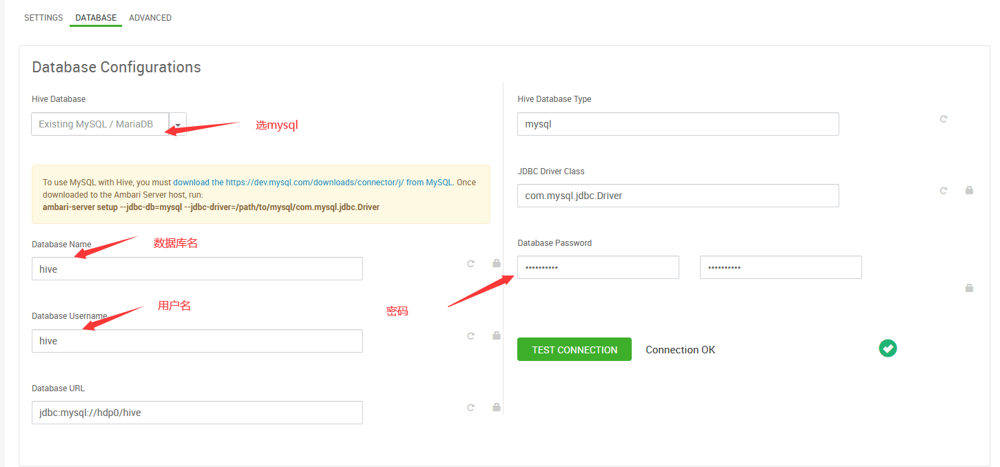

# ambari安装Hive

## 1. 前置要求

开始前一定要使用`ambari-server setup --jdbc-db=mysql --jdbc-driver=/usr/share/java/mysql-connector-java.jar`无论`/etc/ambari-server/conf/ambari.properties`这个文件里是否已经写了。

并且在安装之前还有一件事情要做。

```sql
mysql -u root #进入mysql命令行
CREATE DATABASE hive; #创建Hive数据库
CREATE USER 'hive'@'%' IDENTIFIED BY 'hive'; #创建Hive用户并设置密码为hive
GRANT ALL PRIVILEGES ON hive.* TO 'hive'@'%'; #授予Hive用户对Hive数据库的所有权限
FLUSH PRIVILEGES;
quit;
```

## 2. 安装Hive

### 2.1 点击安装

<figure><figcaption></figcaption></figure>

### 2.2 然后我一般会选择安装了mysql的主节点作为hive组件部署点

<figure><figcaption></figcaption></figure>

### 2.3 仅供参考

<figure><figcaption></figcaption></figure>

### 2.4 按要求填入信息，并验证连接

<figure><figcaption></figcaption></figure>

### 2.5 一路向前，等待安装完毕


如遇error请解决后继续安装

