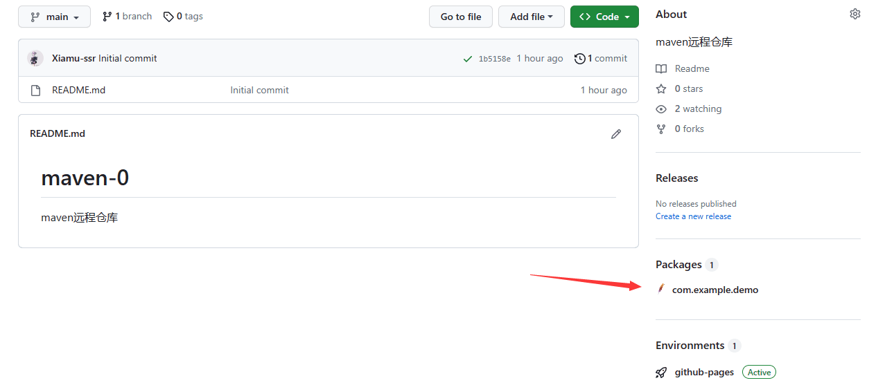

# GitHub远程maven私人仓库

主要参考资料如下



### 前置步骤

创建一个github public仓库，勾选Readme

### 修改\~/.m2/setting.xml

没有这个文件就从`/usr/share/maven/conf/settings.xml`cp一份。

分段添加以下内容到对应标签位置

```xml
  <activeProfiles>
    <activeProfile>github</activeProfile>
  </activeProfiles>
    
  <profiles>
    <profile>
      <id>github</id>
      <repositories>
        <repository>
          <id>central</id>
          <url>https://repo1.maven.org/maven2</url>
        </repository>
        <repository>
          <id>github</id>
          <url>https://maven.pkg.github.com/xiamu-ssr/maven-0</url>
          <!--把xiamu-ssr改成你的github用户名，maven-0改成你的仓库名，大写改小写-->
          <snapshots>
            <enabled>true</enabled>
          </snapshots>
        </repository>
      </repositories>
    </profile>
  </profiles>
  
  <servers>
    <server>
      <id>github</id>
      <username>Xiamu-ssr</username>
      <!--Xiamu-ssr改成你的用户名，分大小写-->
      <password>your_token</password>
      <!--填入你的token-->
    </server>
  </servers>

```

### 发布包

先修改pom.xml，这是项目里的xml，添加以下内容

```xml
  <distributionManagement>
   <repository>
     <id>github</id>
     <name>GitHub OWNER Apache Maven Packages</name>
     <url>https://maven.pkg.github.com/xiamu-ssr/maven-0</url>
     <!--把xiamu-ssr改成你的github用户名，maven-0改成你的仓库名，大写改小写-->
   </repository>
  </distributionManagement>
```

`mvn deploy`就可以把包发布到github仓库了，网速不好用代理，遇到错误加`-X -e`

### 查看包

<figure><figcaption></figcaption></figure>

### 使用包

查看包步骤点进去，看到使用方法，也很简单，按照步骤

把内容添加到pom.xml

然后`mvn install`就可以了
