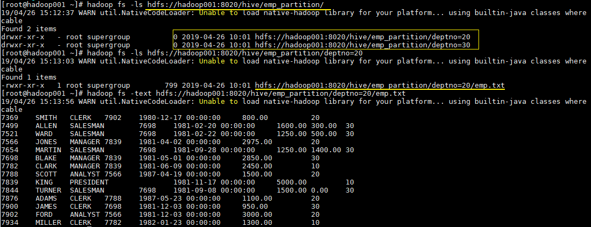
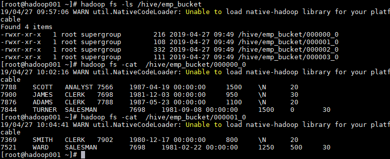

# Hive分区表和分桶表

## 一、分区表

### 1.1 概念

Hive 中的表对应为 HDFS 上的指定目录，在查询数据时候，默认会对全表进行扫描，这样时间和性能的消耗都非常大。

**分区为 HDFS 上表目录的子目录**，数据按照分区存储在子目录中。如果查询的 `where` 字句的中包含分区条件，则直接从该分区去查找，而不是扫描整个表目录，合理的分区设计可以极大提高查询速度和性能。

### 1.2 使用场景

通常，在管理大规模数据集的时候都需要进行分区，比如将日志文件按天进行分区，从而保证数据细粒度的划分，使得查询性能得到提升。

### 1.3 创建分区表

在 Hive 中可以使用 `PARTITIONED BY` 子句创建分区表。表可以包含一个或多个分区列，程序会为分区列中的每个不同值组合创建单独的数据目录。下面的我们创建一张雇员表作为例子：

```sql
 CREATE EXTERNAL TABLE emp_partition(
    empno INT,
    ename STRING,
    job STRING,
    mgr INT,
    hiredate TIMESTAMP,
    sal DECIMAL(7,2),
    comm DECIMAL(7,2)
    )
    PARTITIONED BY (deptno INT)   -- 按照部门编号进行分区
    ROW FORMAT DELIMITED FIELDS TERMINATED BY "\t"
    LOCATION '/hive/emp_partition';
```

### 1.4 加载数据到分区表

加载数据到分区表时候**必须要指定数据所处的分区**：

```sql
--加载部门编号为20的数据到表中
LOAD DATA LOCAL INPATH "/usr/file/emp20.txt" OVERWRITE INTO TABLE emp_partition PARTITION (deptno=20)
--加载部门编号为30的数据到表中
LOAD DATA LOCAL INPATH "/usr/file/emp30.txt" OVERWRITE INTO TABLE emp_partition PARTITION (deptno=30)
```

### 1.5 查看分区目录

这时候我们直接查看表目录，可以看到表目录下存在两个子目录，分别是 `deptno=20` 和 `deptno=30`,这就是分区目录，分区目录下才是我们加载的数据文件。

```bash
hadoop fs -ls  hdfs://hadoop001:8020/hive/emp_partition/
```

这时候当你的查询语句的 `where` 包含 `deptno=20`，则就去对应的分区目录下进行查找，而不用扫描全表。

<figure><figcaption></figcaption></figure>

## 二、分桶表

### 1.1 简介

分区提供了一个隔离数据和优化查询的可行方案，但是并非所有的数据集都可以形成合理的分区，分区的数量也不是越多越好，过多的分区条件可能会导致很多分区上没有数据。同时 Hive 会限制动态分区可以创建的最大分区数，用来避免过多分区文件对文件系统产生负担。鉴于以上原因，Hive 还提供了一种更加细粒度的数据拆分方案：分桶表 (bucket Table)。

分桶表会将指定列的值进行哈希散列，并对 bucket（桶数量）取余，然后存储到对应的 bucket（桶）中。


哈希散列是一种将任意长度的数据映射为固定长度散列值的技术。


### 1.2 创建分桶表

在 Hive 中，我们可以通过 `CLUSTERED BY` 指定分桶列，并通过 `SORTED BY` 指定桶中数据的排序参考列。下面为分桶表建表语句示例：

```sql
  CREATE EXTERNAL TABLE emp_bucket(
    empno INT,
    ename STRING,
    job STRING,
    mgr INT,
    hiredate TIMESTAMP,
    sal DECIMAL(7,2),
    comm DECIMAL(7,2),
    deptno INT)
    CLUSTERED BY(empno) SORTED BY(empno ASC) INTO 4 BUCKETS  --按照员工编号散列到四个 bucket 中
    ROW FORMAT DELIMITED FIELDS TERMINATED BY "\t"
    LOCATION '/hive/emp_bucket';
```

### 1.3 加载数据到分桶表


直接使用 `Load` 语句向分桶表加载数据，数据时可以加载成功的，但是数据并不会分桶。


这是由于分桶的实质是对指定字段做了 hash 散列然后存放到对应文件中，这意味着向分桶表中插入数据是必然要通过 MapReduce，且 Reducer 的数量必须等于分桶的数量。由于以上原因，分桶表的数据通常只能使用 CTAS(CREATE TABLE AS SELECT) 方式插入，因为 CTAS 操作会触发 MapReduce。但是也可以使用 INSERT INTO 语句来插入数据，只要设置 `hive.enforce.bucketing` 为 true。加载数据步骤如下：

```sql
INSERT INTO TABLE emp_bucket SELECT *  FROM emp;  --这里的 emp 表就是一张普通的雇员表
```

### 1.5 查看分桶文件

bucket(桶) 本质上就是表目录下的具体文件：

<figure><figcaption></figcaption></figure>

## 三、分区表和分桶表结合使用

分区表和分桶表的本质都是将数据按照不同粒度进行拆分，从而使得在查询时候不必扫描全表，只需要扫描对应的分区或分桶，从而提升查询效率。两者可以结合起来使用，从而保证表数据在不同粒度上都能得到合理的拆分。下面是 Hive 官方给出的示例：

```sql
CREATE TABLE page_view_bucketed(
	viewTime INT, 
    userid BIGINT,
    page_url STRING, 
    referrer_url STRING,
    ip STRING )
 PARTITIONED BY(dt STRING)
 CLUSTERED BY(userid) SORTED BY(viewTime) INTO 32 BUCKETS
 ROW FORMAT DELIMITED
   FIELDS TERMINATED BY '\001'
   COLLECTION ITEMS TERMINATED BY '\002'
   MAP KEYS TERMINATED BY '\003'
 STORED AS SEQUENCEFILE;
```

此时导入数据时需要指定分区：

```sql
INSERT OVERWRITE page_view_bucketed
PARTITION (dt='2009-02-25')
SELECT * FROM page_view WHERE dt='2009-02-25';
```
