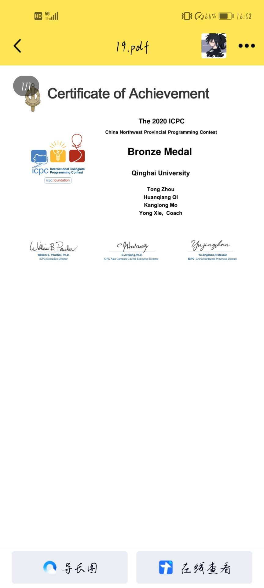
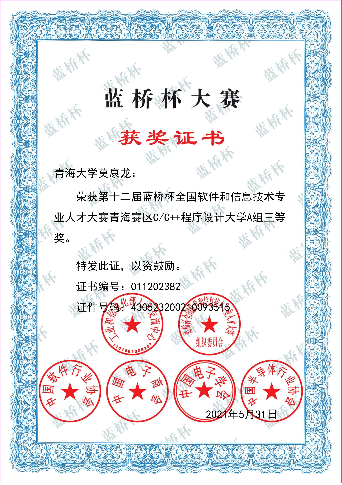
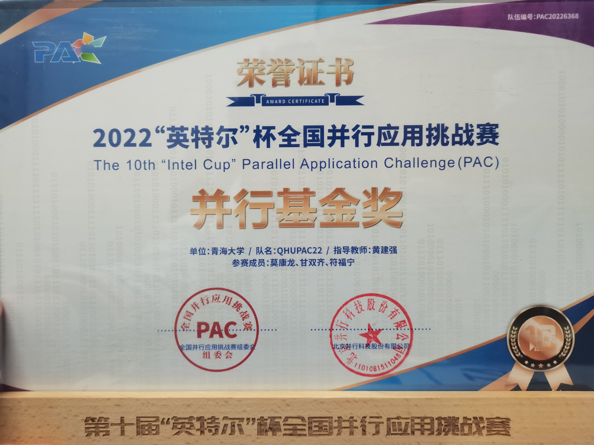
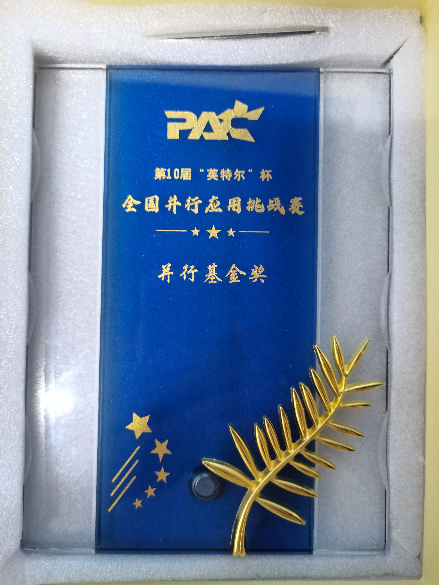
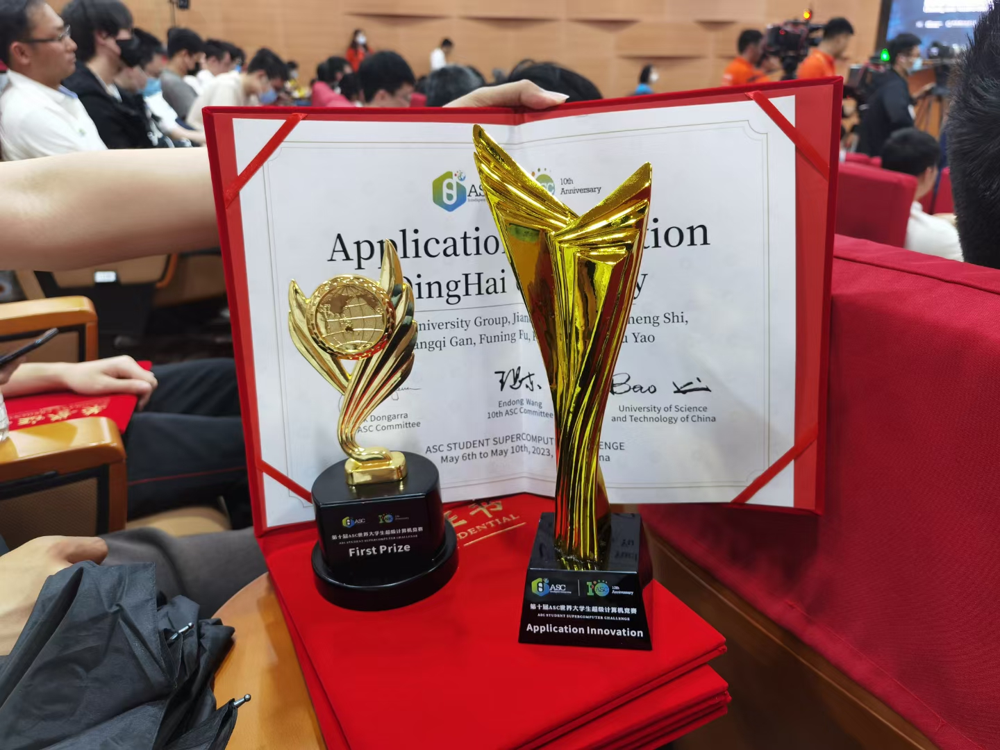
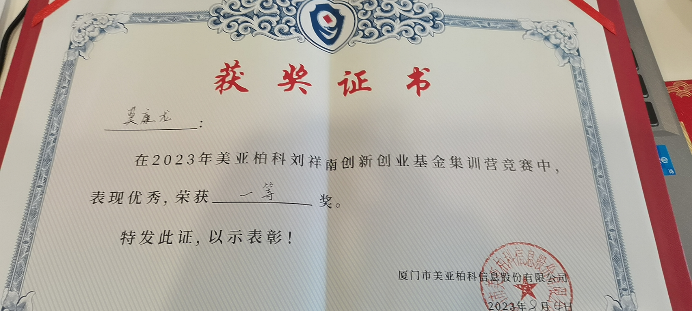

# 奖项存档



#### ICPC中国西北赛区铜奖

原邮件已经找不到了，只留存了当时的一张截图。[这里是官网可以查询区域赛结果](https://icpc.global/regionals/results)

<figure><figcaption></figcaption></figure>



#### 第十二届蓝桥杯省三 

[这里是官网可以查询结果](https://dasai.lanqiao.cn/pages/v7/dasai/cert/cert\_list.html?n=%E8%8E%AB%E5%BA%B7%E9%BE%99\&c=430523200210093515\&t=1)

<figure><figcaption></figcaption></figure>

#### 团体程序设计天梯赛团队省一+个人国三 

[这里是官网可以查询结果](https://gplt.patest.cn/notification)\
[或者点这个链接直接下载2021年获奖名单](https://gplt-prod.nos-eastchina1.126.net/GPLT4a39bbfdbef33339.pdf)\
或者点下面直接看我备份2份pdf





<figure><figcaption></figcaption></figure>



#### "英特尔"杯并行应用挑战赛并行基金奖 

是[并行教育](http://www.paraedu.org.cn/home/index)的一个赛事，简称PAC，另一个叫国产CPU并行应用挑战赛（CPC）\
这个比赛的奖是今年过年的时候才到手，时间挺近，记得比较清楚。

<figure><figcaption></figcaption></figure>

<figure><figcaption></figcaption></figure>



#### ICPC中国西北赛银奖 

没错，我又来了，2020那是刚入学没多久，写不出几个码，后来几场因为疫情搁置了，今年才重新启动。

这是获奖原PDF.



#### ASC22决赛团队一等奖 

ASC世界大学生超级计算机竞赛（ASC Student Supercomputer Challenge，简称ASC超算竞赛）

因为疫情，22年初的初赛，23年5月的决赛，一场漫长的马拉松。感谢我的队友和老师们。


ASC超算公众号原文


<figure><figcaption></figcaption></figure>

#### ICPC丝绸之路银奖



**美亚柏科集训营**

<figure><figcaption></figcaption></figure>


