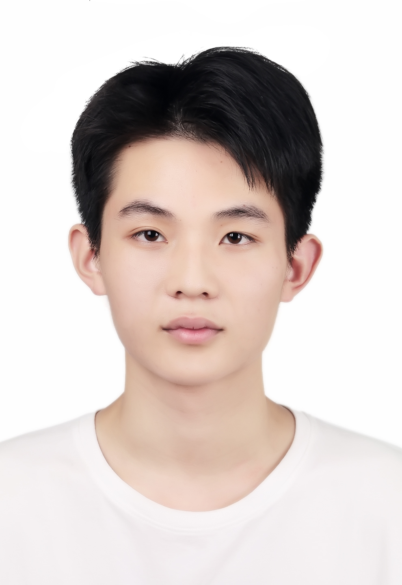
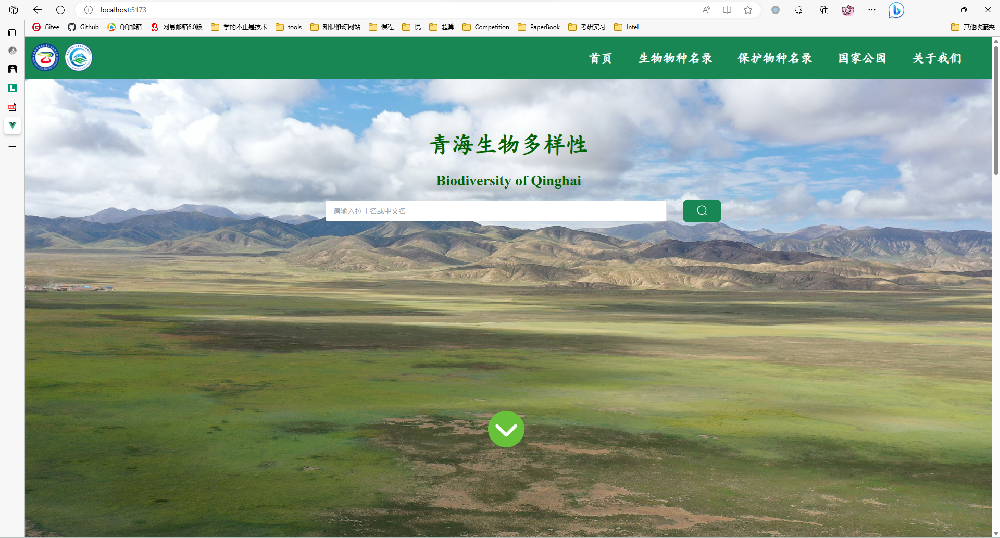
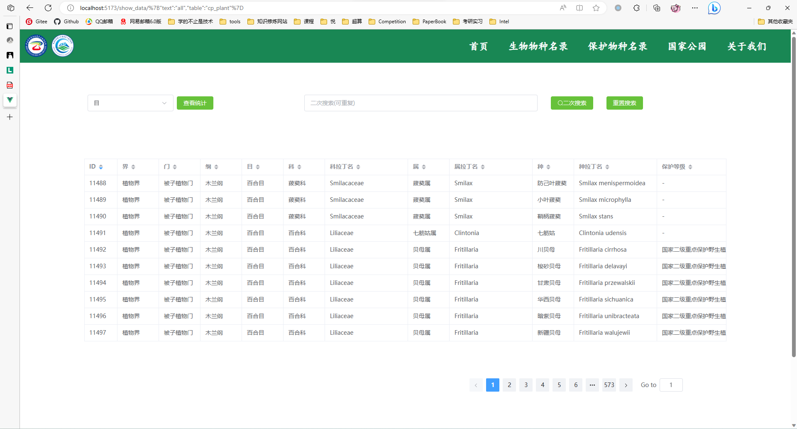
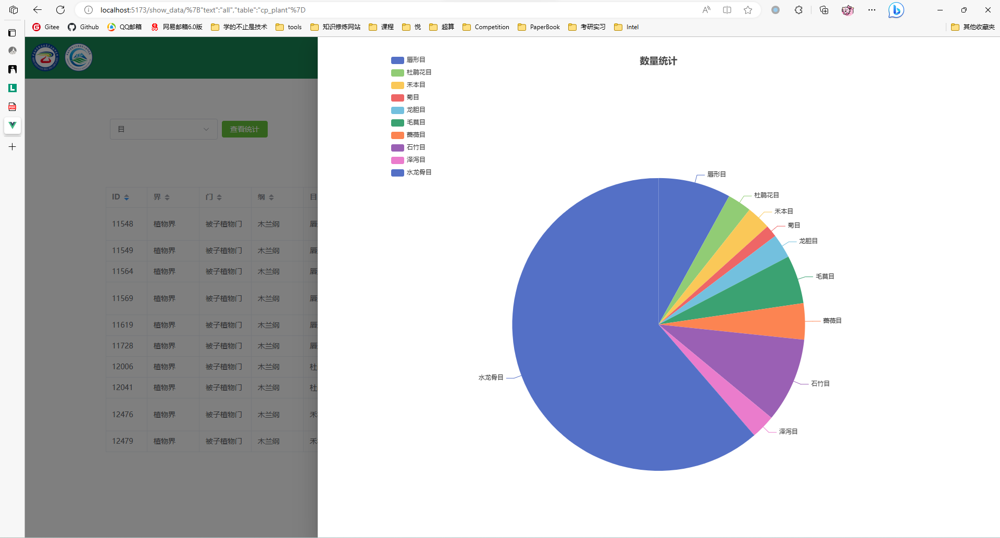
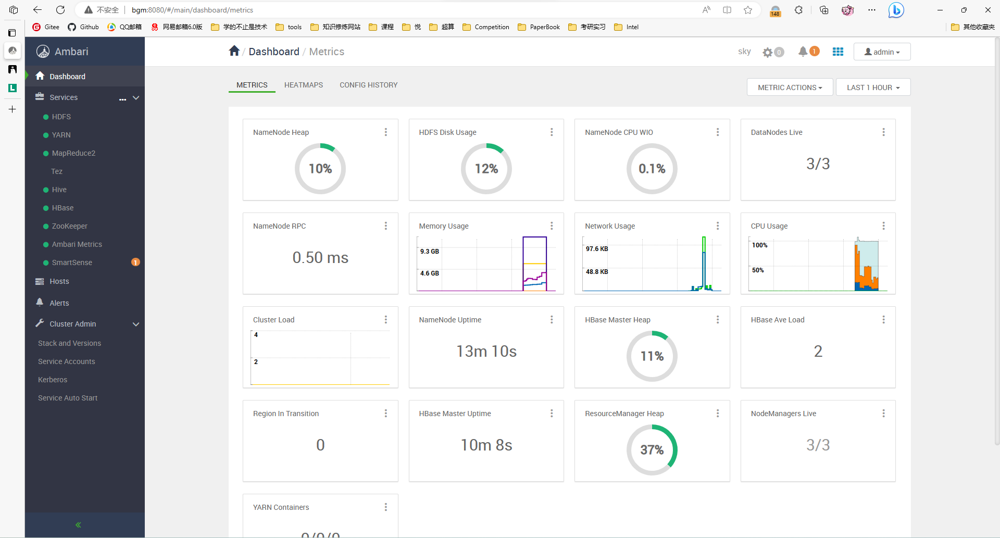
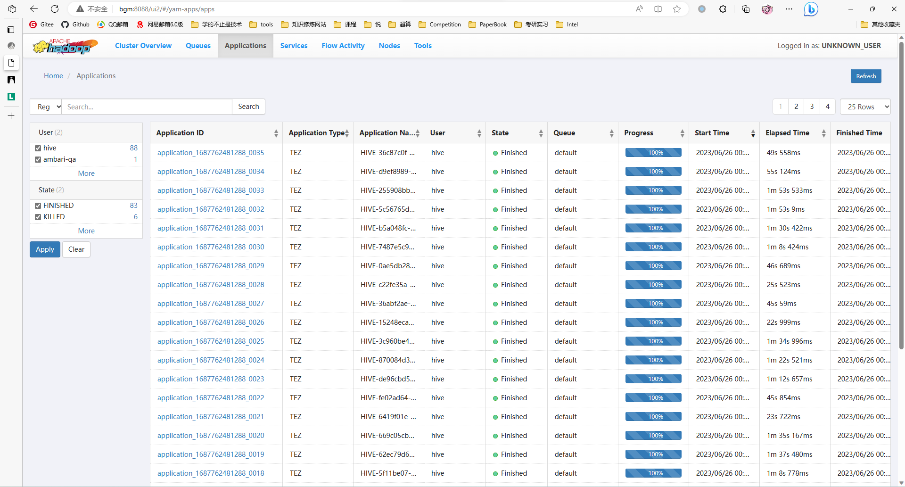

# 简历信息



<figure><figcaption></figcaption></figure>


<figure><figcaption></figcaption></figure>




```
熟悉Python、C、C++等多门编程语言。熟练使用Linux系统和Docker容器化技术。有OMP、MPI、CUDA、DPC++等并行框架使用经验和并行优化经验。了解并使用过Pytorch等机器学习框架。了解并使用过HDFS、MapReduce、YARN、Hive等大数据组件以及Ambari等工具。实践能力强，对于新事物能够短时间内学习并加以使用。
```





```
电商用户行为数据分析
2023.05-2023.06
部署大数据集群，离线挖掘分析用户行为数据，将结果可视化。

使用VMware虚拟化技术在本地部署Ambari Hadoop集 群，维护集群的稳定良好状态。使用hive从一亿条数据中离线分析 出转化漏斗、价值用户等指标并进行可视化展示。同时尝试结合多 方面优化技巧，提高整个流程效率。
```



```
青海生物名录可视化开发
2023.03-2023.06
通过网页将青海生物名录的各类信息展示在互联网上， 赋予其宣传便捷性和时效性。

使用Python和Mysql搭建存储生物信息的数据库，通过 Vue和Flask框架设计前后端交互网页，最后使用Docker容器技术便 捷部署项目。
```



```
基于GPU的图神经网络优化
2022.09-2023.06
图Graph相较于图像Image拥有更复杂的结构，适用于更多领域，但天生存在并行难点。本项目通过使用GPU来缩短图神 经网络的训练时长。

阅读优秀文献，同时自学Pytorch框架和PyG库等使用，对优秀模型进行复现，结合多方面寻找性能瓶颈，参数调优。
```


如果想知道更多，可以选择上Github，不过大多没有详细的Readme。



<figure><figcaption></figcaption></figure>

<figure><figcaption></figcaption></figure>

<figure><figcaption></figcaption></figure>

<figure><figcaption></figcaption></figure>

<figure><figcaption></figcaption></figure>

<figure><figcaption></figcaption></figure>



<table><thead><tr><th width="317.66666666666663"></th><th width="259"></th><th></th></tr></thead><tbody><tr><td>ICPC中国西北赛(团队)</td><td>铜奖</td><td>2020</td></tr><tr><td>第十二届蓝桥杯C/C++A组(个人)</td><td>省三等奖</td><td>2021</td></tr><tr><td>团体程序设计天梯赛(团队)</td><td>省一等奖+个人国三等奖</td><td>2021</td></tr><tr><td>英特尔杯全国并行应用挑战赛(团队)</td><td>并行基金奖</td><td>2022</td></tr><tr><td>ASC22决赛(团队)</td><td>全球一等奖+创新奖</td><td>2022</td></tr><tr><td>ICPC中国西部赛(团队)</td><td>银奖</td><td>2023</td></tr><tr><td>ICPC丝绸之路(团队)</td><td>银奖</td><td>2023</td></tr></tbody></table>


