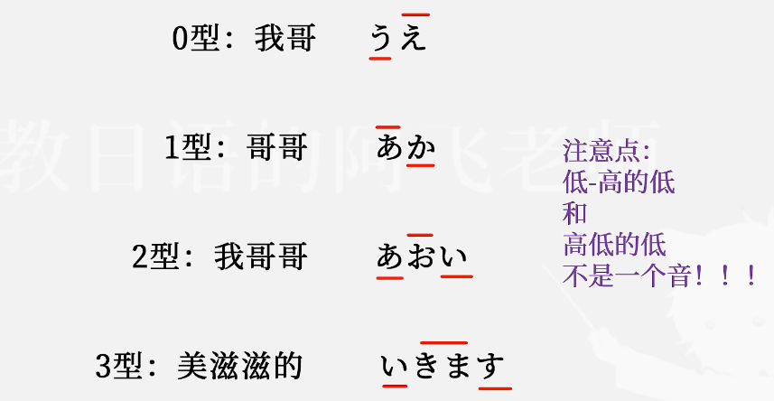

# 日常小记

2023/05

#### 28

终于在本地用虚拟机安装好了ambari，命令`hadoop fs -ls /`有反应，努力没有白费，只装了一个HDFS，YARN因为内存不够，坐等32\*2内存条到货。

#### 29

速通了一遍maven，并且用github搭建了远程私人maven仓库。

#### 30

浅读了一番大数据的经典三论文，google确实6。看了HDFS，MapReduce和YARN看了一部分

#### 31

看完了YARN，内存条到了，出了点问题，重装了系统，win11，配了环境。

2023/06

#### 1

配环境，旧磁盘识别不到了，需要硬盘盒当做U盘接入。配WSL。重现搭建hadoop集群，这次要开5个！！虚拟机

#### 2

5个虚拟机，部署出来了！enjoy :-)，打算去学校服务器用docker试试。本机核太少了qwq。

#### 3

看了一些hive。实操了Linux+Docker搭建hadoop集群。

#### 4

比了icpc丝绸之路，银奖到手。不过太早，睡眠不足。今天linuxdocker安装hive出现了玄学bug，hive get不到mysql配置页面。。。然后ambari server restart莫名其妙把ambari集群配置重置了？？？nothing left，然后重新装的时候，在一开始选择hive就可以装上，是时候重新来一遍了，一定要记得打包传docker hub。windowsVM就可以get到mysql，但是呢？连不上。oh shit。linuxdocker hive可以用了，不错不错。

**5**

重新搞了一遍linux+docker部署hadoop，并且录了视频，发到了b站。知乎，csdn也相继更新。

从bigdata-base镜像做了主节点和从节点镜像，传到了docker hub，下次部署linux+docker就更方便了。

**6**

学了点HQL。做了从镜像简易部署的文档和视频，都已发布。突然发现，windows+docker真是个不错的选择，轻量级，比WSL快，更省地方，关键是可以打包传云端。先用一段时间，如果没有什么特大的缺陷，打算代替WSL2和VMware了，至少在部署hadoop集群方面。

**7**

给女朋友指点Web-Java项目。更新了qhubl网站。找老师聊了大数据相关项目。

**8**

windows+docker实践过了，已发布。打算先做个基础的，电商平台信息分析。还在找数据。

**9**

嗯？漏了一天？

**10**

更新了master和slave镜像。在本地搭建了一个比较满意的hadoop集群。

**11**

一边修理host，一边熟悉ambari-server ui。CRIT是真多。看了一些Hive。纪念一下

**12**

hive，集群，各种bug。。。

**13**

hive死活无法用上管理员，各种配置都修改了，明天再不行打算换方案了。

**14**

hive的问题解决了，又遇上了Tez的bug，难以解决，有点恶心，想换CDH了

**15**

废了，CDH虽然部署成功了，但是小bug和细节比ambari还多，而且感觉不太友好。。。

**16**

重头来一遍ambari，对细节理解更深刻了 。发现可能不是Tez的问题，因为mapreduce组件也通不过测试程序，即使ambari都显示它们为良好。这可能是docker容器的原因或者centos，因为网络是肯定没有问题的，但是datastream总是将datanode标记为无效。

**17**

虽然有进展，但是感觉只是error换了个样子。Tez还是没能解决，摸鱼了一天，明天打算用回VMware，如果还是有问题，就要去寻找在线hive了。

**18**

0红，Tez测试也轻松过了，fuck，就该用VMware完全虚拟化。docker对于大数据或许很重要，但是并不适合部署集群。剪辑了视频。

**19**

剪辑发布了windows+ambari。测试了hive、tez等组件，都正常。完整认真写了一份简历，投给了湖南国家超算中心。

**20**

跟着做了淘宝用户行为分析，做了一些，返回去研究表结构了，ORC+snappy压缩或许会更有优势。明天继续，师夷长技优长技。

**21**

测试了qhubl项目，修复了小bug，99.8%完好，就等部署了。校面了美亚柏科。

**22**

&#x20;边做边优化。在bgs3安装了dataease，需要的资源真多啊。

.png>)

**23**

尝试了PyHive库，还不错，基本上快分析完了

**24**

把用户行为数据分析写完了，后期其实还可以继续扩展，比如把hive当数据源，用pytorch通过属性，来判断用户价值。在写SpringBoot+Vue

**25**

Java可真够难写的，搞一天，勉强前后端可以通信。

**26**

SpringBoot写完了，前后端加密通信，可以先搁置了。Dataease可视化淘宝用户行为数据的分析结果，完成了。该准备简历了。

**27**

投了很多简历，搬宿舍，在线做了综合测评。

**28**

简历到面试占比真够小的。大数据可以先告一段落了。开始着手AI，提前准备美亚柏科的集训，继续GNN领域。

**29**

